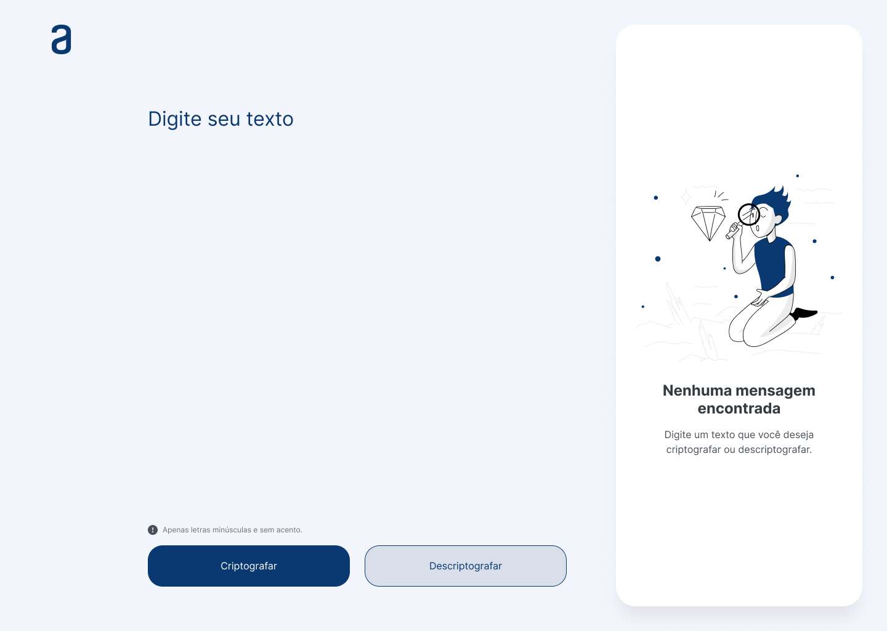
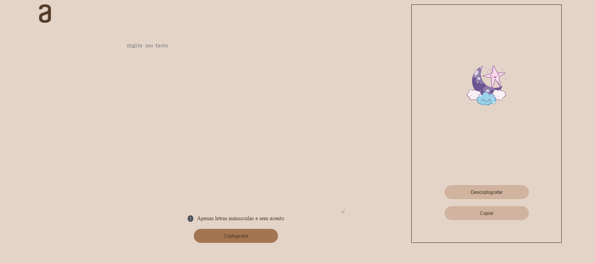
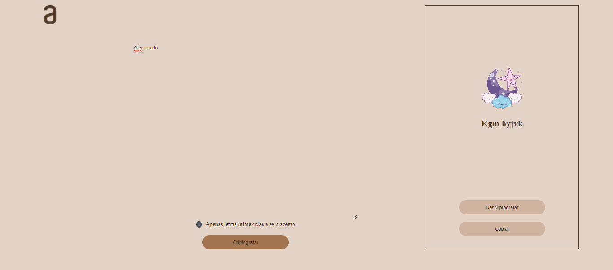
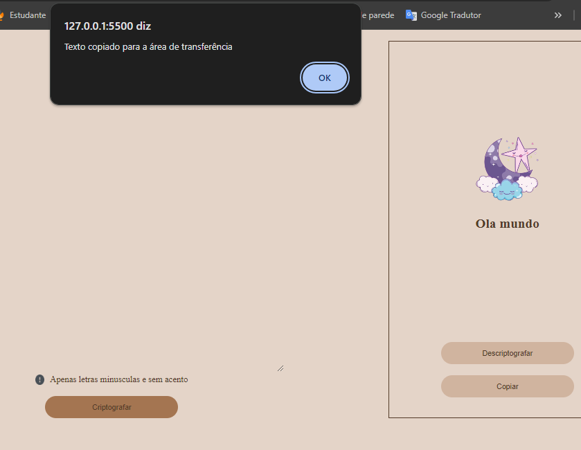

<h1 align="center">Challenges ONE</h1>
<h2> Encriptador de texto</h2>

## 📝 Descrição
Projeto desenvolvido atrás do curso de Logica de Programação da ALURA. Afim de colocar em pratica conteudos vistos em aulas e praticas feitas ao decorrer do curso. Este curso serve de conclusão. Trata-se de um encriptador de texto, no qual possui um campo para digitar o texto a ser encriptografado, e um outro campo para mostrar o resultado, assim como um botão para que possa ser copiado o texto encriptografado podendo assim ser compartilhado.

## 🎨 Layout

O layout da aplicação está disponível no Figma:

<a href="https://www.figma.com/design/6R4f51spYkqt8gpJLLeaSh/Alura-Challenge---Desafio-1---L%C3%B3gica-(Copy)?node-id=0-1&t=bEbwiytoFiMSVfTc-1">
  
</a>

<h3>Resultado:</h3>


<br>


<br>


<br>


<br>

---
Deploy do Projeto:
* [Deploy](https://decodificador-nine-gold.vercel.app/)


## 🚀 Acessar e modificar o projeto
Para rodar o repositório é necessário clonar o mesmo, dar o seguinte comando para iniciar o projeto:
### Clone este repositório
```
git clone <https://github.com/Joanadayse/decodificador>
```
### Acesse a pasta do projeto no terminal
```
<cd decodificador>
```
## 🛠 Tecnologias utilizadas
* [Html](https://developer.mozilla.org/pt-BR/docs/Web/HTML)
* [Css](https://developer.mozilla.org/pt-BR/docs/Web/CSS)
* [JavaScript](https://developer.mozilla.org/pt-BR/docs/Web/JavaScript)


#  👨‍💻 Autora

Feito com ❤️ por Joana Dayse 👋🏽 Entre em contato!

[](https://https://www.linkedin.com/in/daysejoana7//) 
[](mailto:daysejoana7@gmail.com)

